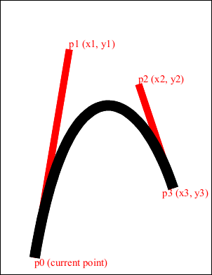
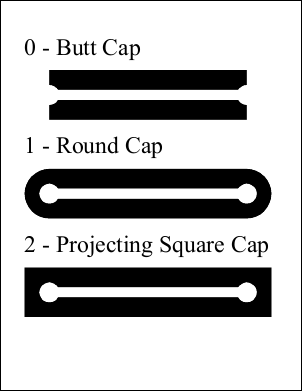

<h1>PDF ABCpdf.Drawing</h1>
<h2>.NET project demonstrating how to port System.Drawing code for output to PDF.</h2>

This code sample shows how to:

<ul>
<li>Stroke and fill paths</li>
<li>Transform coordinates</li>
<li>Draw bezier curves</li>
<li>Set line joins and caps</li>
<li>Use clipping paths</li>
<li>Set line dot or dash patterns</li>
<li>Use transparency</li>
<li>Draw, fill and outline text</li>
<li>Show and manipulate raster images</li>
</ul>

In the screenshots below you can see a variety of outputs from this project.

<em>The ABCpdf Team</em>

